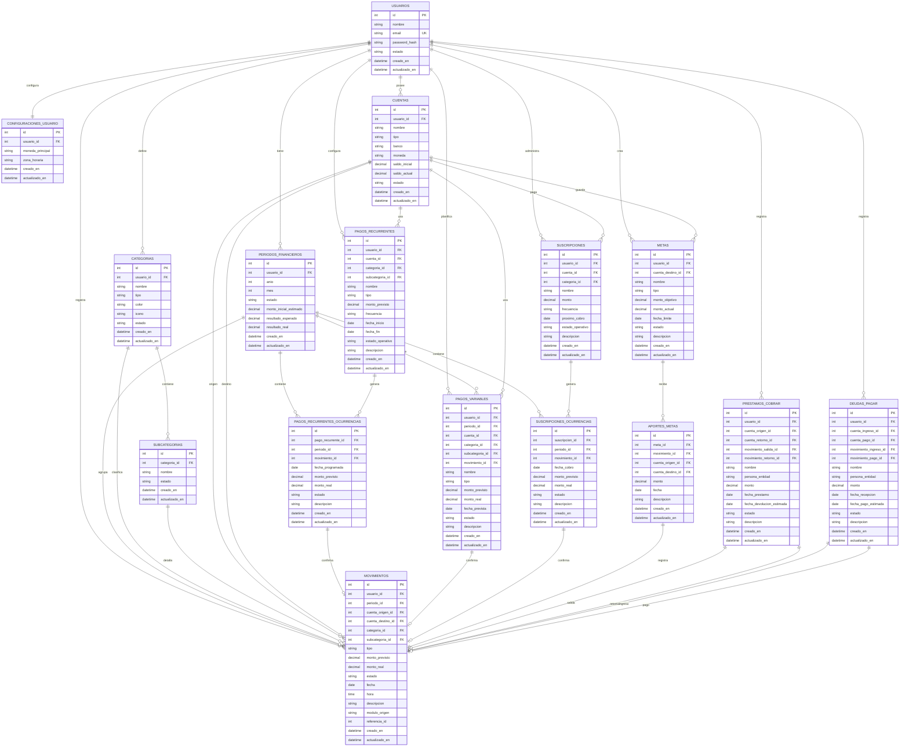

# 07 - Arquitectura base del sistema

## Estado del documento

Propuesta inicial basada en la vision general y los modulos definidos hasta ahora.

Esta arquitectura sirve como base para empezar a construir el backend, pero debe validarse cuando se implemente el codigo y cuando se definan reglas faltantes.

## Objetivo

Definir una base completa de tablas y relaciones para sostener el sistema financiero personal.

La idea principal es evitar duplicidad de datos, mantener historial y separar claramente:

- Lo planificado.
- Lo confirmado.
- Lo eliminado.
- Los movimientos reales.
- Las reglas mensuales.
- Los modulos que generan movimientos.

## Principio central

El sistema debe tener una tabla central de movimientos.

Los demas modulos pueden crear, planificar o confirmar informacion, pero el historial financiero debe pasar por movimientos.

Ejemplo:

- Un pago recurrente confirmado genera un movimiento.
- Una suscripcion confirmada genera un movimiento.
- Un aporte a una meta genera un movimiento.
- Un prestamo genera salida y recuperacion.
- Una deuda genera ingreso y pago.

## Tablas principales propuestas

### Acceso y configuracion

- `usuarios`
- `configuraciones_usuario`

### Calendario financiero

- `periodos_financieros`

Esta tabla no representa un modulo visible. Sirve para ordenar los calculos por mes y permitir vistas futuras.

### Dinero y clasificacion

- `cuentas`
- `categorias`
- `subcategorias`
- `movimientos`

### Planificacion y compromisos

- `pagos_recurrentes`
- `pagos_recurrentes_ocurrencias`
- `pagos_variables`
- `suscripciones`
- `suscripciones_ocurrencias`

### Objetivos y obligaciones

- `metas`
- `aportes_metas`
- `prestamos_cobrar`
- `deudas_pagar`

## Responsabilidad de cada tabla

| Tabla | Responsabilidad |
| --- | --- |
| `usuarios` | Guarda el acceso personal del sistema. |
| `configuraciones_usuario` | Guarda configuraciones generales como moneda principal. |
| `periodos_financieros` | Representa cada mes de trabajo, actual, pasado o futuro. |
| `cuentas` | Guarda las cuentas donde existe o se mueve dinero. |
| `categorias` | Clasifica ingresos y egresos. |
| `subcategorias` | Da mas detalle dentro de una categoria. |
| `movimientos` | Historial central de ingresos, egresos y transferencias. |
| `pagos_recurrentes` | Define pagos o ingresos que se repiten. |
| `pagos_recurrentes_ocurrencias` | Representa cada aparicion mensual o periodica de un recurrente. |
| `pagos_variables` | Guarda ingresos o gastos planificados para un mes especifico. |
| `suscripciones` | Define servicios con renovacion periodica. |
| `suscripciones_ocurrencias` | Representa cada renovacion planificada o confirmada. |
| `metas` | Guarda objetivos financieros. |
| `aportes_metas` | Registra aportes realizados a metas. |
| `prestamos_cobrar` | Controla dinero prestado a terceros. |
| `deudas_pagar` | Controla dinero recibido que debe devolverse. |

## Estados base

### Estados de movimientos

- `pendiente`
- `confirmado`
- `eliminado`

### Estados operativos

Aplican a recurrentes, suscripciones y metas cuando corresponda.

- `activo`
- `pausado`
- `finalizado`

### Estados de prestamos y deudas

- `pendiente`
- `pagado`
- `eliminado`

## Reglas importantes

- El ahorro no es gasto. Se registra como transferencia.
- Las suscripciones no deben duplicarse como pagos recurrentes normales.
- Los pagos recurrentes son plantillas; sus ocurrencias representan cada aparicion en el tiempo.
- Los pagos variables pertenecen a un periodo financiero especifico.
- Un movimiento pendiente afecta el calculo esperado.
- Un movimiento confirmado afecta el resultado real.
- Un movimiento eliminado queda visible, pero no debe contarse como activo.
- Prestamos y deudas afectan cuentas, movimientos y calculos mensuales.
- Por ahora no se manejan pagos parciales de prestamos ni deudas.
- Por ahora se maneja una sola moneda general.

## Diagrama ERD completo

Ver tambien:

- [ERD visual completo](diagrams/erd/sistema_completo.md)
- [Fuente Mermaid](diagrams/erd/sistema_completo.mmd)
- [Fuente DBML](diagrams/erd/sistema_completo.dbml)

