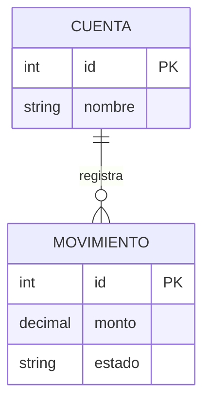

# ERD visual

Este diagrama es una version inicial. Debe actualizarse cuando se analice la base de datos real.

## Diagrama completo recomendado

- [ERD completo del sistema](sistema_completo.md)
- [Fuente Mermaid completa](sistema_completo.mmd)
- [Fuente DBML completa](sistema_completo.dbml)

## Diagrama simple inicial

## Archivos fuente

- [Mermaid](erd.mmd)
- [DBML](erd.dbml)
