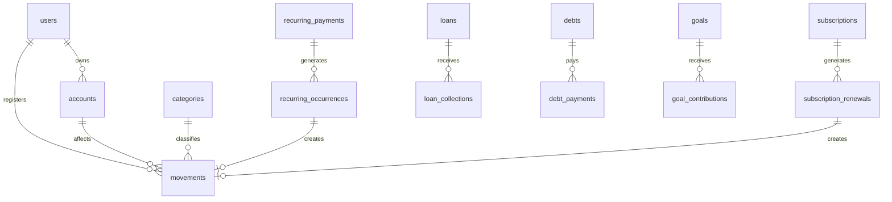

# ERD visual

Diagramas actualizados con la especificacion de base de datos/API.

## Diagrama completo recomendado

- [ERD completo del sistema](sistema_completo.md)
- [Fuente Mermaid completa](sistema_completo.mmd)
- [Fuente DBML completa](sistema_completo.dbml)

## Diagrama reducido

## Archivos fuente

- [Mermaid](erd.mmd)
- [DBML](erd.dbml)
