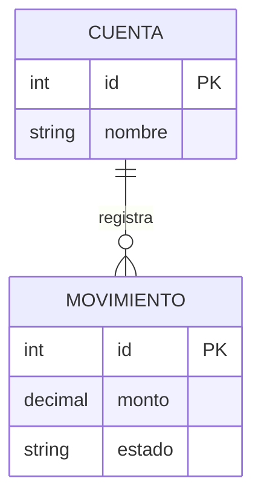

# ERD visual

Este diagrama es una version inicial. Debe actualizarse cuando se analice la base de datos real.

```mermaid
erDiagram
    CUENTA {
        int id PK
        string nombre
    }

    MOVIMIENTO {
        int id PK
        decimal monto
        string estado
    }

    CUENTA ||--o{ MOVIMIENTO : registra
```

## Archivos fuente

- [Mermaid](erd.mmd)
- [DBML](erd.dbml)

