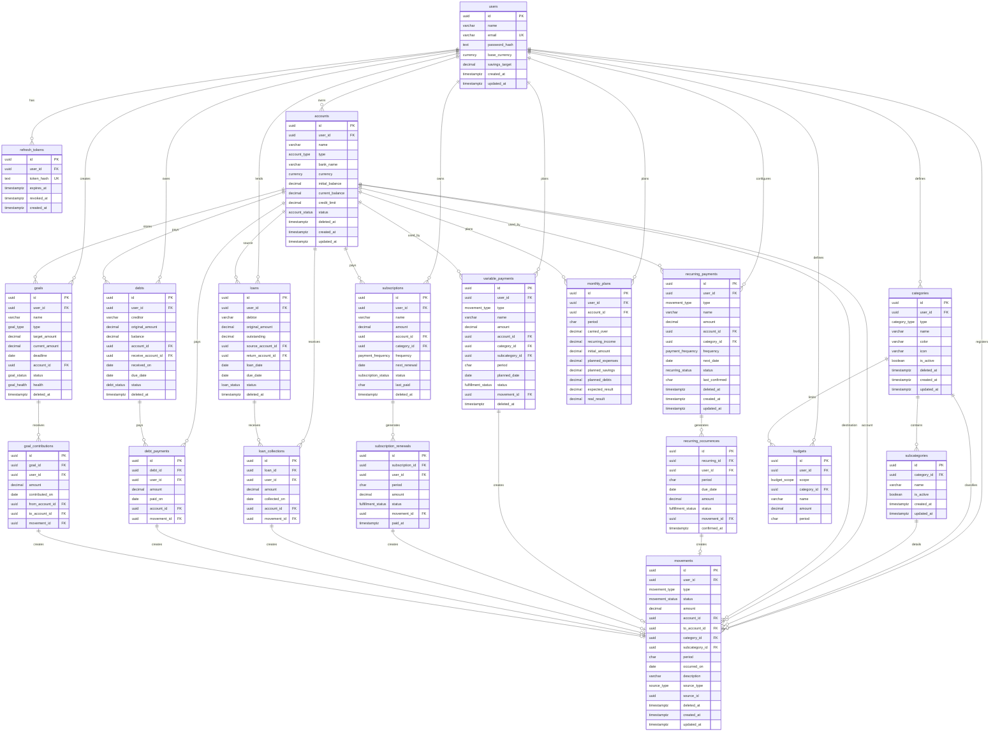

# ERD completo del sistema

Este diagrama representa el modelo base actualizado segun la especificacion de base de datos/API.

```mermaid
erDiagram
    users {
        uuid id PK
        varchar name
        varchar email UK
        text password_hash
        currency base_currency
        decimal savings_target
        timestamptz created_at
        timestamptz updated_at
    }

    refresh_tokens {
        uuid id PK
        uuid user_id FK
        text token_hash UK
        timestamptz expires_at
        timestamptz revoked_at
        timestamptz created_at
    }

    accounts {
        uuid id PK
        uuid user_id FK
        varchar name
        account_type type
        varchar bank_name
        currency currency
        decimal initial_balance
        decimal current_balance
        decimal credit_limit
        account_status status
        timestamptz deleted_at
        timestamptz created_at
        timestamptz updated_at
    }

    categories {
        uuid id PK
        uuid user_id FK
        category_type type
        varchar name
        varchar color
        varchar icon
        boolean is_active
        timestamptz deleted_at
        timestamptz created_at
        timestamptz updated_at
    }

    subcategories {
        uuid id PK
        uuid category_id FK
        varchar name
        boolean is_active
        timestamptz created_at
        timestamptz updated_at
    }

    movements {
        uuid id PK
        uuid user_id FK
        movement_type type
        movement_status status
        decimal amount
        uuid account_id FK
        uuid to_account_id FK
        uuid category_id FK
        uuid subcategory_id FK
        char period
        date occurred_on
        varchar description
        source_type source_type
        uuid source_id
        timestamptz deleted_at
        timestamptz created_at
        timestamptz updated_at
    }

    recurring_payments {
        uuid id PK
        uuid user_id FK
        movement_type type
        varchar name
        decimal amount
        uuid account_id FK
        uuid category_id FK
        payment_frequency frequency
        date next_date
        recurring_status status
        char last_confirmed
        timestamptz deleted_at
        timestamptz created_at
        timestamptz updated_at
    }

    recurring_occurrences {
        uuid id PK
        uuid recurring_id FK
        uuid user_id FK
        char period
        date due_date
        decimal amount
        fulfillment_status status
        uuid movement_id FK
        timestamptz confirmed_at
    }

    variable_payments {
        uuid id PK
        uuid user_id FK
        movement_type type
        varchar name
        decimal amount
        uuid account_id FK
        uuid category_id FK
        uuid subcategory_id FK
        char period
        date planned_date
        fulfillment_status status
        uuid movement_id FK
        timestamptz deleted_at
    }

    subscriptions {
        uuid id PK
        uuid user_id FK
        varchar name
        decimal amount
        uuid account_id FK
        uuid category_id FK
        payment_frequency frequency
        date next_renewal
        subscription_status status
        char last_paid
        timestamptz deleted_at
    }

    subscription_renewals {
        uuid id PK
        uuid subscription_id FK
        uuid user_id FK
        char period
        decimal amount
        fulfillment_status status
        uuid movement_id FK
        timestamptz paid_at
    }

    loans {
        uuid id PK
        uuid user_id FK
        varchar debtor
        decimal original_amount
        decimal outstanding
        uuid source_account_id FK
        uuid return_account_id FK
        date loan_date
        date due_date
        loan_status status
        timestamptz deleted_at
    }

    loan_collections {
        uuid id PK
        uuid loan_id FK
        uuid user_id FK
        decimal amount
        date collected_on
        uuid account_id FK
        uuid movement_id FK
    }

    debts {
        uuid id PK
        uuid user_id FK
        varchar creditor
        decimal original_amount
        decimal balance
        uuid account_id FK
        uuid receive_account_id FK
        date received_on
        date due_date
        debt_status status
        timestamptz deleted_at
    }

    debt_payments {
        uuid id PK
        uuid debt_id FK
        uuid user_id FK
        decimal amount
        date paid_on
        uuid account_id FK
        uuid movement_id FK
    }

    goals {
        uuid id PK
        uuid user_id FK
        varchar name
        goal_type type
        decimal target_amount
        decimal current_amount
        date deadline
        uuid account_id FK
        goal_status status
        goal_health health
        timestamptz deleted_at
    }

    goal_contributions {
        uuid id PK
        uuid goal_id FK
        uuid user_id FK
        decimal amount
        date contributed_on
        uuid from_account_id FK
        uuid to_account_id FK
        uuid movement_id FK
    }

    budgets {
        uuid id PK
        uuid user_id FK
        budget_scope scope
        uuid category_id FK
        varchar name
        decimal amount
        char period
    }

    monthly_plans {
        uuid id PK
        uuid user_id FK
        uuid account_id FK
        char period
        decimal carried_over
        decimal recurring_income
        decimal initial_amount
        decimal planned_expenses
        decimal planned_savings
        decimal planned_debts
        decimal expected_result
        decimal real_result
    }

    users ||--o{ refresh_tokens : has
    users ||--o{ accounts : owns
    users ||--o{ categories : defines
    users ||--o{ movements : registers
    users ||--o{ recurring_payments : configures
    users ||--o{ variable_payments : plans
    users ||--o{ subscriptions : owns
    users ||--o{ loans : lends
    users ||--o{ debts : owes
    users ||--o{ goals : creates
    users ||--o{ budgets : defines
    users ||--o{ monthly_plans : plans

    categories ||--o{ subcategories : contains
    categories ||--o{ movements : classifies
    subcategories ||--o{ movements : details

    accounts ||--o{ movements : account
    accounts ||--o{ movements : destination
    accounts ||--o{ recurring_payments : used_by
    accounts ||--o{ variable_payments : used_by
    accounts ||--o{ subscriptions : pays
    accounts ||--o{ loans : source
    accounts ||--o{ loan_collections : receives
    accounts ||--o{ debts : pays
    accounts ||--o{ debt_payments : pays
    accounts ||--o{ goals : stores
    accounts ||--o{ monthly_plans : plans

    recurring_payments ||--o{ recurring_occurrences : generates
    recurring_occurrences ||--o| movements : creates

    variable_payments ||--o| movements : creates

    subscriptions ||--o{ subscription_renewals : generates
    subscription_renewals ||--o| movements : creates

    loans ||--o{ loan_collections : receives
    loan_collections ||--o| movements : creates

    debts ||--o{ debt_payments : pays
    debt_payments ||--o| movements : creates

    goals ||--o{ goal_contributions : receives
    goal_contributions ||--o| movements : creates

    categories ||--o{ budgets : limits
```

