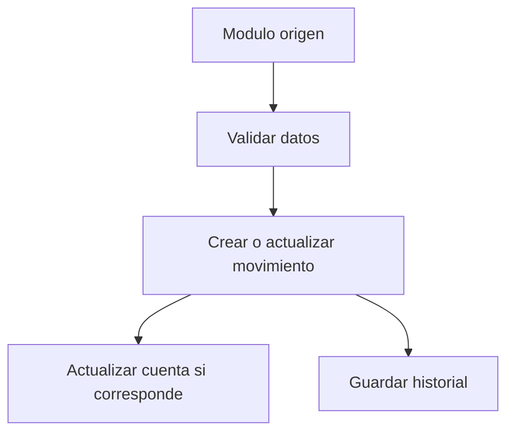
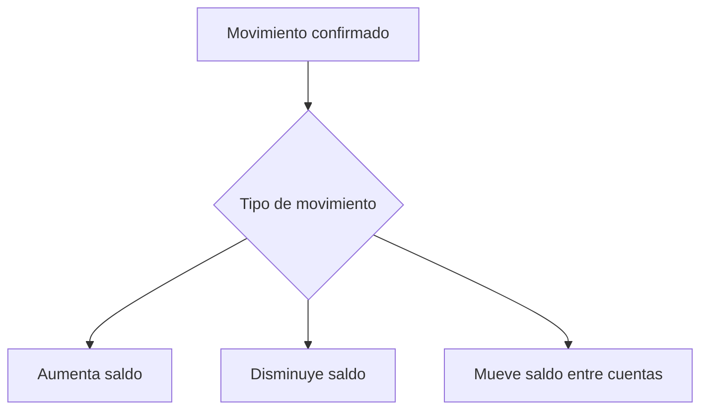
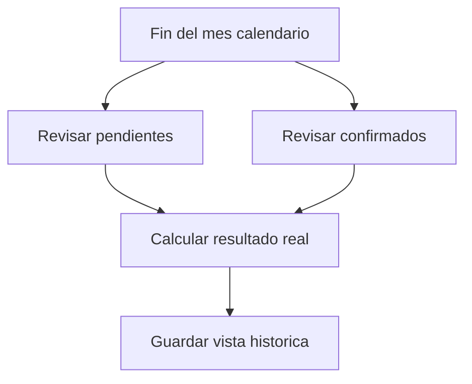
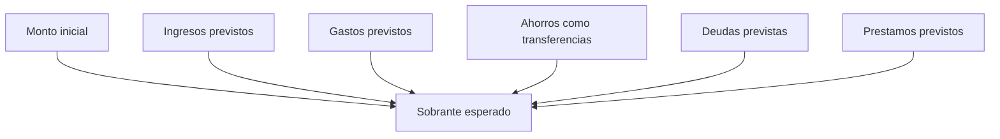

# Flujos visuales

Estos diagramas muestran flujos generales del sistema.

## Flujo de movimientos

## Flujo de cuentas

## Flujo de cierre de mes

## Flujo de resultado esperado

## Archivos fuente

- [Flujo de movimientos](flujo_movimientos.mmd)
- [Flujo de cuentas](flujo_cuentas.mmd)
- [Flujo de cierre de mes](flujo_cierre_mes.mmd)
- [Flujo de resultado esperado](flujo_resultado_esperado.mmd)

