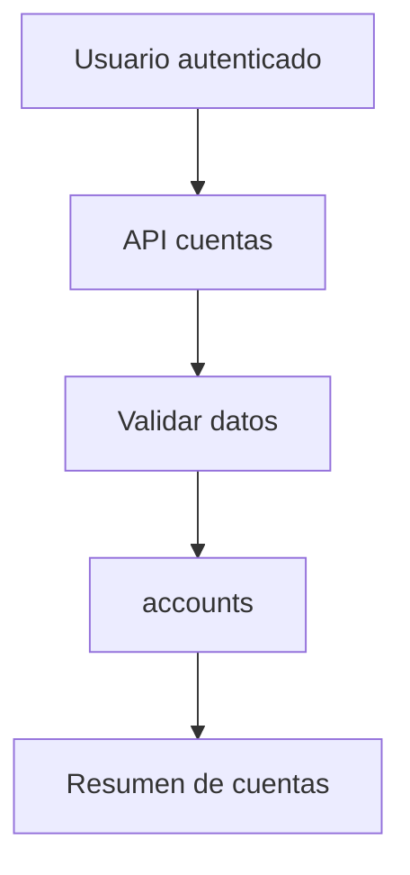
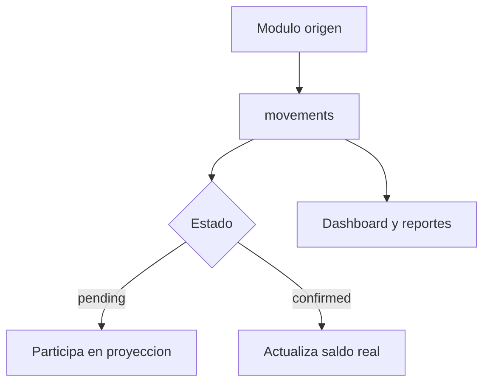
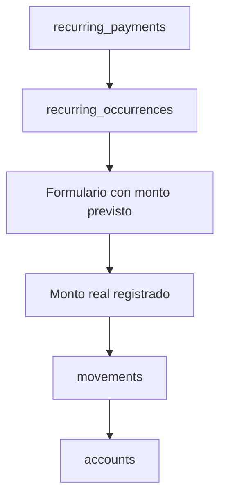

# Flujos visuales

Diagramas actualizados con el avance de cuentas y la especificacion de movimientos.

## Flujo actual de cuentas

## Flujo futuro de movimientos

## Flujo futuro de registrar pago recurrente

## Archivos fuente

- [Flujo de movimientos](flujo_movimientos.mmd)
- [Flujo de cuentas](flujo_cuentas.mmd)
- [Flujo de cierre de mes](flujo_cierre_mes.mmd)
- [Flujo de resultado esperado](flujo_resultado_esperado.mmd)

