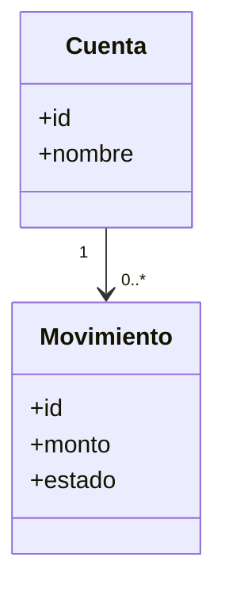
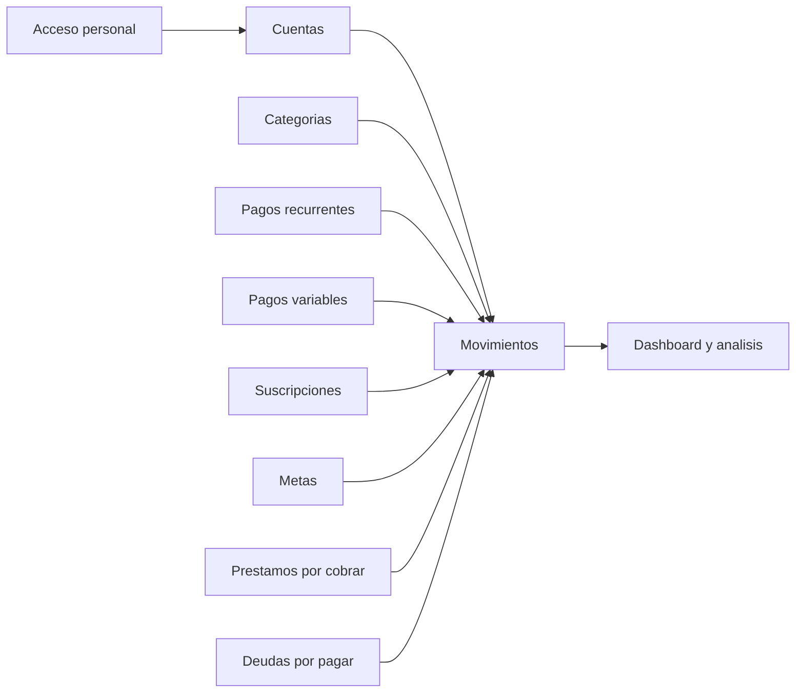

# UML visual

Estos diagramas son versiones iniciales para representar el sistema de forma general.

## Modelo de clases

## Componentes principales

## Archivos fuente

- [Modelo de clases Mermaid](modelo_clases.mmd)
- [Modelo de clases PlantUML](modelo_clases.puml)
- [Componentes Mermaid](componentes_modulos.mmd)
- [Componentes PlantUML](componentes_modulos.puml)
- [Secuencias visuales](secuencias/README.md)

