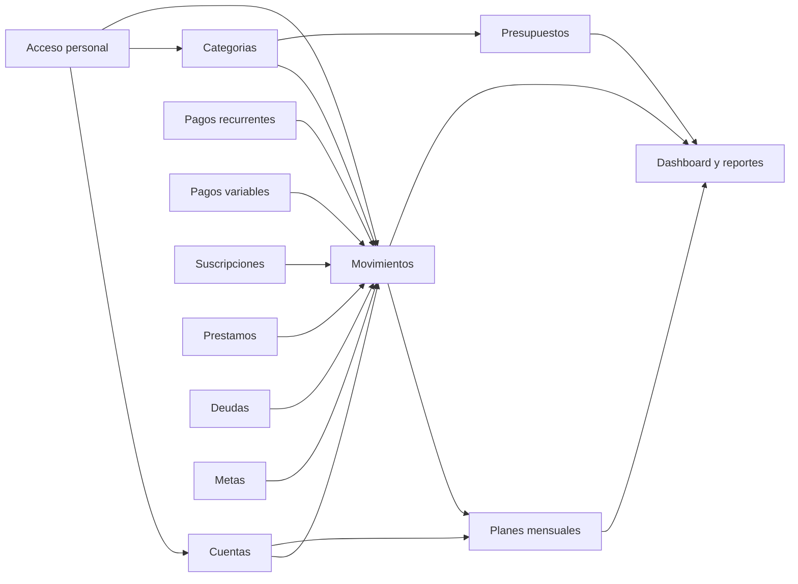
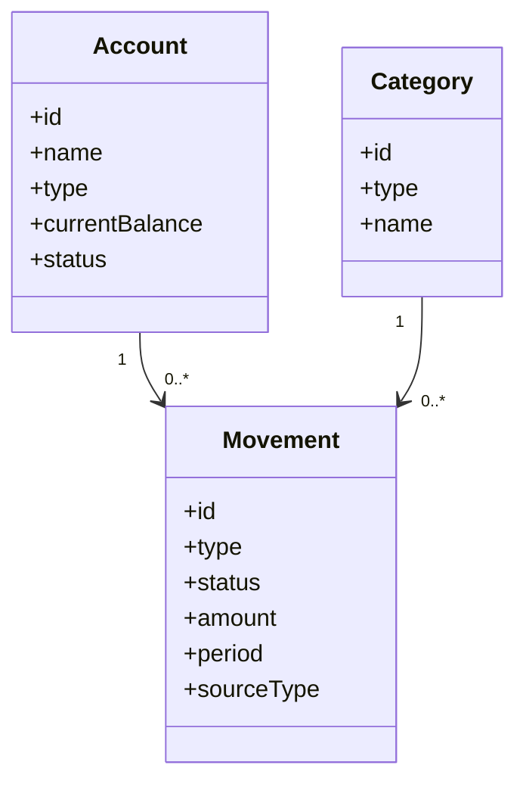

# UML visual

Diagramas actualizados con los modulos definidos en la especificacion.

## Componentes principales

## Modelo simple de clases

## Archivos fuente

- [Modelo de clases Mermaid](modelo_clases.mmd)
- [Modelo de clases PlantUML](modelo_clases.puml)
- [Componentes Mermaid](componentes_modulos.mmd)
- [Componentes PlantUML](componentes_modulos.puml)
- [Secuencias visuales](secuencias/README.md)

