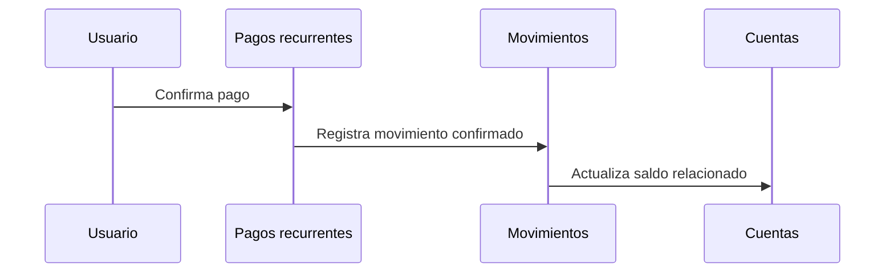
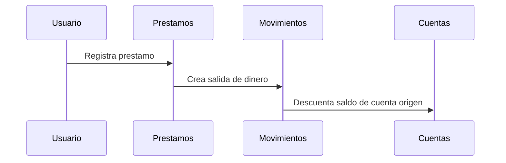
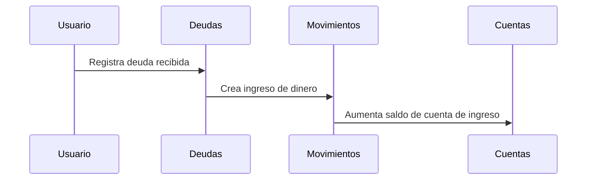

# Secuencias visuales

Estos diagramas muestran flujos iniciales entre usuario, modulos y movimientos.

## Confirmar pago recurrente

## Registrar prestamo

## Registrar deuda

## Archivos fuente

- [Confirmar pago recurrente Mermaid](confirmar_pago_recurrente.mmd)
- [Confirmar pago recurrente PlantUML](confirmar_pago_recurrente.puml)
- [Registrar prestamo Mermaid](registrar_prestamo.mmd)
- [Registrar prestamo PlantUML](registrar_prestamo.puml)
- [Registrar deuda Mermaid](registrar_deuda.mmd)
- [Registrar deuda PlantUML](registrar_deuda.puml)

